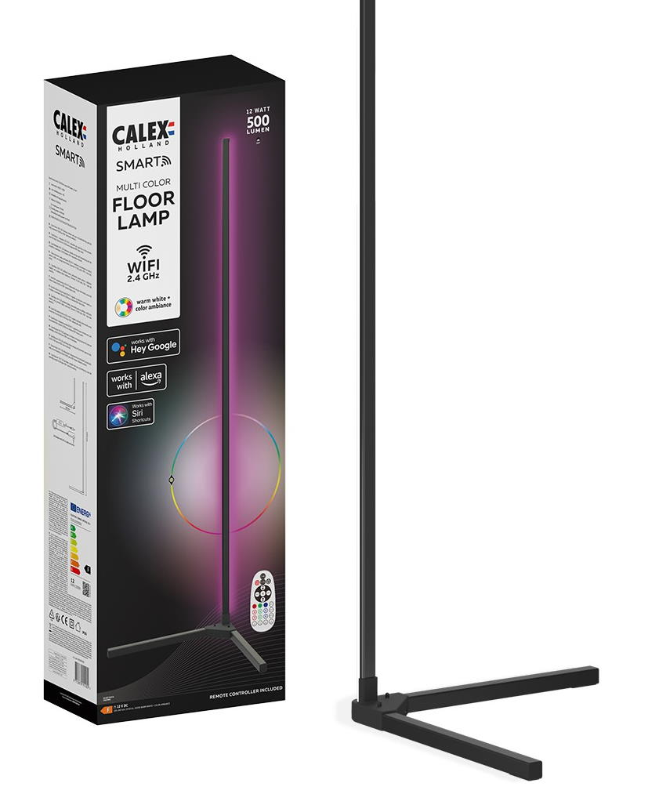

Notes to self about how to modify a [Calex Smart Floorlamp](https://www.calex.eu/en/products/product/CALEX-SMARTVLOERLAMP/) and replace the LMA35 WiFi chip by an ESP8266 running [WLED](https://kno.wled.ge/)

Product:

"[Don't turn it on, take it apart!](https://en.wikipedia.org/wiki/David_L._Jones_(video_blogger))"

The PCB is in the foot of the lamp.

Screw locations:

PCB top:

PCB bottom:

The WiFi module is marked with LMA35. [MaWork77](https://github.com/MaWork77) has [photographed the underside of the module](https://github.com/arendst/Tasmota/discussions/14506?sort=top#discussioncomment-2344006). It contains the pinout. The chip of module is a [Beken BK7231](http://www.bekencorp.com/en/goods/detail/cid/7.html). That chip does not work with the [WLED project](https://kno.wled.ge/basics/compatible-hardware/).

The LED strip is connected with a USB-C connector to the main PCB.

Every 3 RGB LEDS of the strip are driven by a Greeled Electronic [SM16703](https://www.gree-leds.com/web/userfiles/download/SM16703ICdatasheet.pdf) 3-channel chip. All the white LEDS of the driven by a single channel driven by the main PCB. The SM16703 appears to be compatible with WS2811.

According to the SM16703 datasheet, it has an impressive 17 Mega Ampere per channel current capability. The supplied LED strip has 30 pieces of SM16703. At 12V and maximum current to all RGB channels this LED strip needs about 18360000 Watt.
The power supply for this product can deliver only 12 Watt. A typical nuclear power plants output is 1GW, so I need 18 of them to power this LED strip.

Interesting pins of the LMA35:

| Pin | Function |
| -- | -- |
| P16 | SM16703 DATA |
| PWM0 | PWM White LEDs |
| SCK | IR receiver |
| ADC3 | Microphone |
| EN | Enable chip |

To replace the function of this LMA35 with some ESP8266 or ESP32 board you need to disable the LMA35 by connecting `Enable` to ground. Now you are free to solder wired from the other pins to your Espressif WiFi module.

Connecting a ESP8266 or ESP32 for use WLED is covered here: https://kno.wled.ge/basics/getting-started/
There is no need for a level shifter. Keep in mind to measure current usage and configure WLED current-limiting feature to stay under the maximum load current specified by the power supply (12V, 1A).

I used https://install.wled.me/ to install WLED onto a Wemos D1 mini pro. That board without headers is small enough to use double sided (and padded) tape to stick it under the PCB.

WLED LED & Hardware setup

LED output 1:
| Setting | Value |
| -- | -- |
| Chip | WS281x |
| Color Order | RGB |
| Start | 0 |
| Length | 30 |
| GPIO | 2 (D4) |

LED output 2:
| Setting | Value |
| -- | -- |
| Chip | PWM White |
| GPIO | 15 (D8) |

Other:
| Setting | Value | Remark |
| -- | -- | -- |
| IR GPIO | 4 (D2) |
| IR remote type | ? | I do not know. My product came without the promised remote |
| Auto-calculate white channel from RGB | None |
| Brightness factor | 80% | RGB+White on 100% overpowers supply |
Be careful when putting enclosure back together and not pinch any cables.

